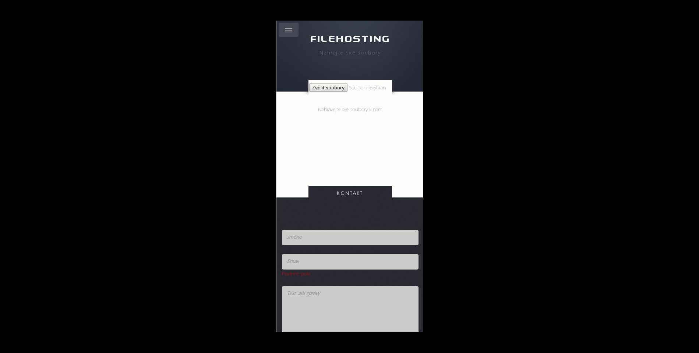

## File Hosting - School project
========

`vertx runmod io.uhk~filehosting~0.0.9`

### Main config - WEB server SockJS server MONGO connection

    {
        "name": "PRODUCTION",
        "enabled": True,
        "version": "0.0.0",
        "port": 80,
        "port_bridge": 8889,
        "host": "localhost",
        "paths": {
            "web": "web/",
            "path_private":"files/private/",
            "path_symlink":"files/symlink/",
            "path_temp":"files/temp/",
            "path_public":"files/public/"
        },
        "mongodb": {
            "address": "vertx.mongopersistor",
            "host": "localhost",
            "port": 27017,
            "db_name": "default_db",
            "pool_size": 20,
        },
        "files_collection": <files>,
        "users_collection": <users>
        "mailer": {
            "address": "mailer",
            "host": "smtp.googlemail.com",
            "port": 465,
            "ssl": True,
            "auth": True,
            "username": <username>,
            "password": <password>,
            "content-type": "text/html"
        }
    }
    
## Screenshots

